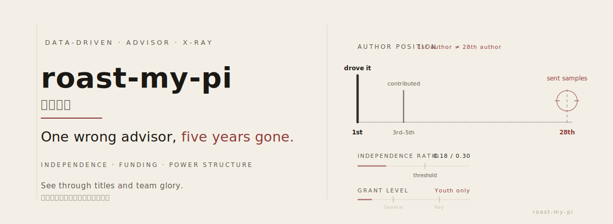

<p align="center">
  <picture>
    <source media="(prefers-color-scheme: dark)" srcset="hero.svg">
    
  </picture>
</p>

<h1 align="center">roast-my-pi</h1>

<p align="center">
  <strong>One wrong advisor, five years gone.</strong><br>
  <em>Data-driven X-ray for academic advisors — see through titles and team glory.</em>
</p>

<p align="center">
  <a href="#-red-flags-cheat-sheet"></a>
  <a href="#-sample-report"></a>
  <a href="#-quick-start"></a>
</p>

<p align="center">
  
  
  
  
</p>

<br>

> **First author on *Nature* ≠ Author #28 on *Nature*.**
>
> Authorship position, grant ownership, co-author power structure — these three things decide whether an advisor is a real PI or just riding a team ticket.

**This tool does one thing:** it takes a potential academic advisor's publications, funding, and collaboration network apart, strips away the institutional halo, and tells you what **they personally** have actually done.

<table>
<tr>
<td align="center" width="33%">

**Independence Ratio**

First / corresponding author
vs. middle-author filler

`0.30` = the PI threshold

</td>
<td align="center" width="33%">

**Grant Ownership**

Their own funding
vs. borrowed grant numbers

General Program = real PI

</td>
<td align="center" width="33%">

**Power Structure**

Lab head vs. peer vs. trainee

Who actually owns the project?

</td>
</tr>
</table>

---

## :triangular_flag_on_post: Red Flags Cheat Sheet

> Save these. Screenshot them. You'll never read a CV the same way.

### 1. Author position beats journal impact factor

First author on *Nature* is not the same as author #28. Where you sit on the author list says everything about what you actually did. Position 20+ usually means you handed over some samples — that's it.

| Same *Nature* paper | What it actually means |
|:---|:---|
| 1st author / corresponding | They drove the work |
| 3rd–5th author | Meaningful contribution |
| 20th+ author | Sent in some samples |

### 2. Independence ratio below 0.15? Not a PI.

Score every paper by the author's role:

| Role | Weight |
|:---|:---|
| First author | +1.0 |
| Corresponding (last + marked) | +1.0 |
| Co-first author | +0.7 |
| Co-corresponding | +0.5 |
| Middle author | +0 |

```
independence_ratio = weighted_score / total_papers
```

| Score | Verdict |
|:---|:---|
| **> 0.30** | Credible independent researcher |
| **0.15 – 0.30** | Building independence, not there yet |
| **< 0.15** | A bench hand, not a lab head |

### 3. "Last author" ≠ PI

People assume the last name on the list is the PI. Wrong — the **corresponding-author marker** is what actually tells you.

- Last position **+** corresponding marker = real PI (weight 1.0)
- Co-corresponding, not last = half the claim (weight 0.5)
- Last position, **no** corresponding marker = probably just the senior name on the door

### 4. A grant in the acknowledgments isn't their grant

Seeing a grant number in the footnotes doesn't mean it belongs to them.

**Cross-check:** pull every paper citing that grant ID and see who's corresponding. If it's always someone else, they're surfing on borrowed money.

> *The real owner of a grant is the person who keeps showing up as corresponding author on papers funded by it.*

### 5. Only ever held a Youth grant? They're stuck.

In the Chinese NSFC funding system, grant tier maps directly to career stage:

| Grant type | Prefix | What it means |
|:---|:---|:---|
| Youth Project | `8xxxxxx` | Entry-level (~210K CNY) — everyone starts here |
| **General Program** | `3xxxxxx` | **The minimum bar for an independent PI** (~550K) |
| Excellent Young | `2xxxxxx` | Elite tier (~2M) |
| Key Program | `7xxxxxx` | Senior PI territory (~3M) |

Years of papers but never a General Program? That's what Chinese academia calls a **"permanent attending"** (万年主治) — stuck at the same rank, never independent.

### 6. Eight years, same boss, still a middle author — that's a ceiling.

- If they keep publishing with the same senior PI and never move up from the middle of the list, they've never carved out their own direction.
- Papers **without** the lab head? That's the real independence signal.
- The **trajectory** matters more than the snapshot: climbing, or flatlined?

---

## :bar_chart: Sample Report

> *Synthetic case disclaimer: this report is fictional, built from real evaluation patterns. No data refers to any actual person.*

### Advisor Insight Report

**Institution:** university-affiliated hospital | **Data source:** common PubMed patterns

<br>

**Independence ratio: `0.18`** — team dependent, not an independent PI *(threshold: 0.30)*

<table>
<tr><td>

**Author role breakdown**

| Role | Share |
|:---|:---|
| First author | ~5–10% |
| Corresponding | < 5% |
| Middle author | **~80%** |
| Large consortium (>20) | ~10% |

</td><td>

**Journal quality**

| Tier | Picture |
|:---|:---|
| T1 Elite (IF > 15) | A handful — always middle author |
| T2 Top (IF 8–15) | Several |
| T3–T4 (IF 2–8) | The bulk; first-author papers here |
| T5 Low / predatory | Yes, some |

</td></tr>
<tr><td>

**Grant ownership**

| Type | Status |
|:---|:---|
| NSFC Youth Project | 1, completed |
| NSFC General Program | **Never** |
| Institutional grants | A couple |

</td><td>

**Co-author power structure**

| Metric | Finding |
|:---|:---|
| Lab head (Boss) | On ~80% of papers, always last |
| This person's position | Position 5–8 / 10–15, year after year |
| Papers without Boss | Almost zero |

</td></tr>
</table>

> **Verdict:** this researcher has spent years as the workhorse middle author in a senior PI's lab. Plenty of high-IF papers, but almost never in the driver's seat. Independence ratio of 0.18 sits well below the 0.30 bar. Only a Youth grant — never a General Program. **Not someone who can independently mentor a PhD student.**

---

## :rocket: Quick Start

```bash
# Load the skill in Hermes Agent
skill_view(name='advisor-insight')

# Then follow the guided workflow
```

**You'll need to provide:**

| Required | Optional |
|:---|:---|
| Full name (Chinese + English) | ORCID (gold standard for ID) |
| Current institution + department | Known collaborators / former students |
| Research-area keywords | Title or rank |

> A name alone won't cut it. You need **at least** institution + department for disambiguation.

---

## :gear: How It Works

```
Phase 0 ── Disambiguation ──────► Cross-check PubMed, ORCID, Scholar, institution pages
                                   Make sure we've got the right person
    │
Phase 1 ── Publication Audit ───► Pull every PubMed paper, classify author role,
                                   compute independence ratio
    │
Phase 2 ── Grant Analysis ──────► Extract grant IDs from acknowledgments,
                                   trace who actually owns each one
    │
Phase 3 ── Co-author Network ──► Count co-authorships, map power structure
                                   and the lab's food chain
    │
Phase 4 ── Career Trajectory ──► Reconstruct the arc from publication history —
                                   is independence growing or stalled?
    │
Phase 5 ── Synthesis ───────────► Standardized score + plain-English verdict
```

---

## :earth_asia: 中文版

<details>
<summary><strong>点击展开完整中文文档</strong></summary>

<br>

### 避坑指南：6 条识破注水导师

> 每一条都能截图单发。读完你不会再被简历唬住。

**1. 看作者位置，别看期刊影响因子**

Nature 一作不等于 Nature 第 28 作者。署名位置才是真实贡献度：第 20+ 作者通常只贡献了样本。盯住一作和通讯论文的数量与质量。

**2. 独立性比率 < 0.15，基本不是独立 PI**

把所有论文按署名角色打分：一作 +1.0，通讯（末位 + 通讯标记）+1.0，共同一作 +0.7，共同通讯 +0.5，中间作者 +0。独立性比率 = 加权得分 / 论文总数。`> 0.30` 可信的独立研究者；`0.15 – 0.30` 独立性发展中；`< 0.15` 团队螺丝钉。

**3. 通讯作者才是真 PI，末位作者可能只是挂名**

末位 + 通讯标记 = 真 PI（权重 1.0）。共同通讯（非末位）= 半个 PI（权重 0.5）。末位但无通讯标记 = 可能只是资深挂名。

**4. 查基金归属，不是看致谢里有没有基金号**

交叉验证：搜索所有用了这个基金号的论文，看谁在这些论文里当通讯。如果全是别人通讯的论文在致谢，他只是蹭了课题组成员的基金。

**5. 只有青年基金 + 院内课题，大概率万年主治**

| 基金类型 | 编号前缀 | 含义 |
|:---|:---|:---|
| 青年项目 | `8xxxxxx` | 入门级，约 21 万 |
| **面上项目** | `3xxxxxx` | **独立 PI 的门槛**，约 55 万 |
| 优青 | `2xxxxxx` | 精英级，约 200 万 |
| 重点项目 | `7xxxxxx` | 资深 PI，约 300 万 |

**6. 跟了同一个 Boss 八年还在中间位置，就是天花板**

看合作网络的权力结构：有没有不带 Boss 独立发的论文？独立性的轨迹比当下状态更重要。

---

### 这是什么

**roast-my-pi（导师锐评）** 是一个 Hermes Agent 技能，系统性地客观评估一位潜在学术导师的真实科研画像：剥离机构光环、虚高头衔、团队荣誉，揭示个人的实际独立贡献。

核心原则：**数据胜于声誉，证据胜于修辞。**

### 它能告诉你什么

- 这个人是真正的独立 PI，还是平台依赖型贡献者
- 实际发文独立性比率，对比团队挂名比率
- 名下到底有没有独立基金（不是蹭的）
- 合作网络中的真实权力位置（Boss / 平级 / 学生）
- 职业轨迹是上升、停滞、还是已经触顶
- 你加入他的组，竞争力和发展前景如何

### 快速开始

```bash
skill_view(name='advisor-insight')
```

需要准备：导师全名（中英文）+ 别名、当前机构 + 科室、职称、ORCID（如有）、已知合作者、研究方向关键词。至少需要机构 + 科室才能开始消歧。

</details>

---

## License

[MIT](LICENSE) — free to use, modify, and distribute.

## Contributing

Contributions welcome — better heuristics, new data sources, additional analysis dimensions. Open an [issue](https://github.com/Nigmat-future/roast-my-pi/issues) or PR.
